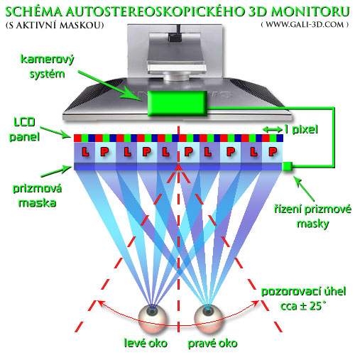

# 3D: Stereoscopic Rendering in Blender

This semester project was focuses on stereoscopic rendering for a multi-view 3D autostereoscopic display manufactured by **DIMENCO**.

The plugin not only renders the 2D image but also generates a corresponding depth map. Both images are then merged with a header containing encoded specifications for the DIMENCO 3D display.

## User Documentation

The plugin is written in Python and is intended for use with **Blender**.

### Usage:
1. Open Blender and go to **Edit > Preferences > Add-ons**.
2. Install the plugin and activate it by checking the box.
3. Run the plugin using the **Render > Render 2D Plus Depth Stereo** button.
4. Choose the directory and filename for the output image and click **"Render 2D Plus Depth Stereo"** to confirm.
5. Wait a moment. Rendering may take longer depending on scene complexity.
6. The output will be saved to the selected directory.

## Theoretical Documentation

Autostereoscopic displays allow users to perceive 3D content without the need for special glasses.

### Principle

The core of this technology is a special mask placed in front of the LCD panel, equipped with optical prisms. These prisms direct light into different angles so that each eye sees a different part of the image (left eye sees only the left view, right eye sees only the right view). Depending on the user's position relative to the screen, the perceived viewing angle of objects changes, enhancing the 3D effect.

### Image Loading Process

#### Image Format
To display images correctly on autostereoscopic screens, a format is used that combines:

1. **2D Image:** The rendered color image from the selected perspective.  
2. **Depth Map:** A grayscale map where bright areas represent objects closer to the user and dark areas represent farther objects.  
3. **Header:** Encoded metadata (with resolution 3840×1) embedded in the image, containing information such as resolution and parameters required for proper display on DIMENCO devices.

**Data Reading:** The TV reads the 2D image, depth map, and metadata from the header.

**Interpolation:** Pixels are interpolated based on depth data. Closer pixels are shifted more than distant pixels, simulating depth.

**Parallax Calculation:** A parallax offset is calculated for each perspective based on object depth.

**Image Generation:** Multiple views are generated from the parallax data, simulating different viewing angles.

**Projection via Mask:** The mask ensures that each view is directed toward a specific angle, so the left and right eyes see different images.

### Depth Map Generation Process

1. **Scene Rendering:** The camera renders the scene from the selected perspective.  
2. **Distance Recording:** Each pixel stores the distance from the camera to the object.  
3. **Normalization and Inversion:** Values are normalized to a 0–255 range and inverted so that:
   - 0 = farthest point  
   - 255 = closest point  

## Developer Documentation

The plugin is written in Python and uses the following libraries:
- `bpy`: Blender Python API
- `os`: For file system operations
- `Pillow`: For image manipulation
- `tempfile`: For temporary file storage during rendering

### Plugin Workflow

**1. Plugin Activation**  
- Activated via **Render > 2D Plus Depth Stereo Renderer**  
- Calls the `execute()` method  

**2. Output File Selection**  
- The plugin prompts the user to select a directory and filename for the output image.

  - **If a path is selected:**  
    - If the file already exists, an error "File name already exists." is shown and the plugin exits.  
    - If the name ends in `.bmp`, the extension is removed.  
    - The final path and filename are stored, and the image rendering begins via `render_stereo_2d_plus_depth(context)`.  

  - **If no file is selected:**  
    - The plugin exits.

**3. Blender Environment Setup**  
- `setup_blender_env(context)` sets the rendering resolution to 1920×2160.

**4. 2D Image Rendering**  
- `render_2d_image(context, tmp_path)` renders the color image and saves it as `.bmp` in a temporary directory.

**5. Depth Map Rendering**  
- `render_depth_image(context, tmp_path)` handles depth map rendering.
- `setup_blender_for_depth(context)` adjusts render settings:
  - Grayscale color mode and 8-bit depth.
  - Activates only the depth (Z) pass for the view layer.
- Compositing nodes are used to normalize and invert the image.
- The result is saved as a `.bmp` depth image in the temporary directory.

**6. Final Image Assembly**  
- After both renders, `render_combined_image(tmp_path, header_path)` is called:
  - Loads the 2D image, depth image, and header image.
  - Combines them into a single `.bmp` file:
    - Depth map on the left, 2D image on the right, header embedded in the top row.

**7. User Notification**  
- Once rendering is complete, a message is shown:  
  **"Rendered image saved at {filepath}.bmp"**

## Sources

- **Article on autostereoscopic displays (https://cs.gali-3d.com/autostereoskopie-3d/):** Provided basic information on the principles behind autostereoscopic screens and illustrative images.
- **Blender Python API Documentation:** Provided essential info for Blender plugin development.
- **DIMENCO Display Specifications:** Offered technical details about the 2D-plus-Depth format.
- **ChatGPT Queries:** Used mainly for clarifying Blender Python API and explaining the image projection theory on autostereoscopic displays.
